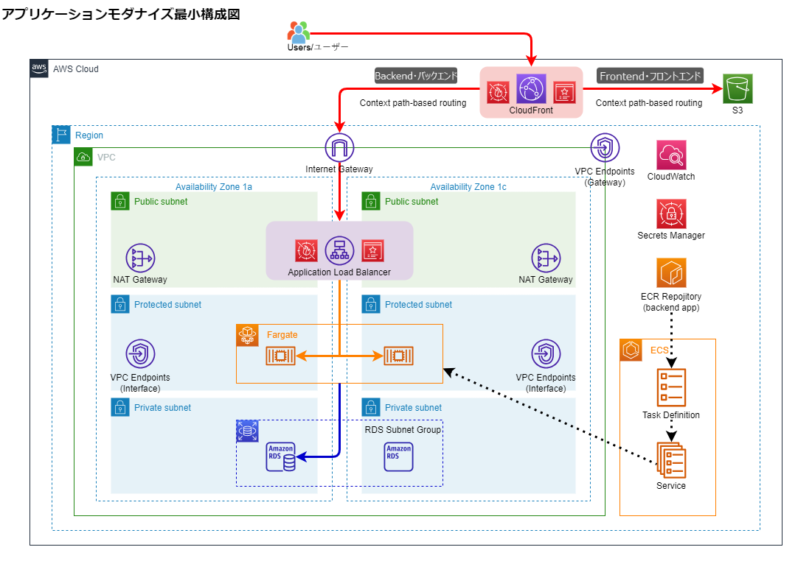

# AWS AU (Application Unit)環境のアプリケーションインフラIaC化

このリポジトリ―は、AWS AU (Application Unit)環境でアプリケーションインフラを構築する為のテンプレートを運用・管理するためのものです。
IaC化の実装は、Terraformを使用します。


### リポジトリの管理について
テンプレートを利用の際は、当リポジトリをプロジェクト管理のリポジトリへ「フォーク」してご利用ください。


## 環境構築

AWSへの環境構築手順は [/infra/README.md](./infra/README.md)を参照してください。


## テンプレート開発環境

テンプレート開発環境で使用するソフトウェアは表の通りです。  
記載のソフトウェアは全てYMSL開発者ツールのため、OA-Cubeへの申請は不要です。  
(インストールは、[YMSLイントラページ](https://globalymc.sharepoint.com/teams/ymsl/SitePages/%E3%83%9B%E3%83%BC%E3%83%A0.aspx) -> Architecture Wiki -> YMSL開発者ツール -> リストを参照してください。)


| ソフトウェア名 | 必須 | 備考 |
|---------------|------|-----|
| Visual Studio Code | 〇 | 拡張機能「Dev Container」を追加してください（拡張機能は申請不要） |
| Docker Desktop for Windows | 〇 | Dev Containerを使用して開発<br>使用には、Docker BusinessライセンスをSREチームに申請する必要があります（※） |
| Terraform CLI (Terraform Community Edition) | 〇 | Dev Container環境にインストールして使用 |

- ※ Docker Desktop for Windowsライセンス申請については、[YMSLイントラページ](https://globalymc.sharepoint.com/teams/ymsl/SitePages/%E3%83%9B%E3%83%BC%E3%83%A0.aspx) -> Architecture Wiki -> YMSL開発者ツール -> docker desktop を参照願います。


## ローカル環境開発

ローカルPC上のコンテナ内で開発作業ができるように、テンプレートにはDockerfileを含めています。  
ローカル開発環境をコンテナで起動させることで、Terraformコマンドを使用できるようになります。  
開発環境の起動は下記の手順でおこなえます。
1. Docker Desktop for Windowsを起動する
2. テンプレートをVSCodeで開く  
3. 左下の≶マークを押す、または右下に表示されるメッセージから「コンテナーで再度開く（Reopen in Container）」を選択  
（自動的にDockerfileがビルドされ、VSCodeがDevContainerで起動する）
4. AWSへ接続するための一時クレデンシャルを取得  
一時クレデンシャルの取得は [/docs/temporary_credentials/README.md](./docs/temporary_credentials/README.md)を参照してください。
5. 取得した一時クレデンシャルを、コンテナ上で起動したVSCodeのターミナルに貼り付けて実行


## リポジトリーのフォルダー構成

``` text
+-cloudformation                      : AWS AU環境のVPCテンプレート  
|  
+-docs                                : ドキュメント  
|  
+-infra  -+- main.tf                  : main設定  
          +- variables.tf             : 変数設定  
          +- terraform.tfvars         : 共通設定値  
          +- README.md                : 環境構築手順のドキュメント
          |  
          +- docker +- niginx         : NGINX用コンテナイメージ定義  
          |  
          +- env ---+- _default       : 環境定義のテンプレート
          |         |  
          |         +- dev            : 開発環境  
          |         |  
          |         +- stg            : ステージング環境 (※未実装)  
          |         |  
          |         +- prd            : 本番環境 (※未実装)  
          |  
          +-module -+- alb            : alb設定  
                    |  
                    +- aurora         : RDS for aurora (postgresql) 設定  
                    |  
                    +- cloudfront     : cloudfront設定  
                    |  
                    +- ec2            : 踏み台EC2サーバ設定  
                    |  
                    +- ecr            : ECR設定  
                    |  
                    +- ecs            : ECS設定  
                    |  
                    +- iam            : IAM設定 (※未実装)  
                    |  
                    +- nginx          : NGINX設定 (Frontendの社内LAN公開用)  
                    |  
                    +- oidc           : oidc設定  
                    |  
                    +- rds            : RDS for postgresql設定  
                    |  
                    +- s3             : S3設定 (Frontend用)  
                    |  
                    +- security_group : セキュリティグループ設定  
                    |  
                    +- vpc            : vpcエンドポイント設定  
                    |  
                    +- waf            : AWS WAF設定  
```

### 編集対象

最小構成の作成に必要な定数定義は、「tfvars」ファイルでおこなえます。  
構成する環境に合わせて、env下のファイルを編集してください。


``` text
├ env 
   └ _default/dev/stg/prd/ 
         ├  inital_terraform_config.sh   : Terraform初期設定ファイル
         ├  internal.tfvars              : インターネット公開用環境設定ファイル   
         ├  internet.tfvars.template     : インターネット公開用初期設定ファイル     
         ├  localnet.tfvars              : 社内LAN公開用環境設定ファイル
         ├  localnet.tfvars.template     : 社内LAN公開用初期設定ファイル
         └  system_config                : 環境設定ファイル
```
  
  
> [!NOTE]   
>   moduleフォルダ内の各フォルダはAWSサービスの設定ファイルです。
>  ``` text
>  ├ module 
>      ├ <service-name> /     
>      |       ├ main.tf            :   変数など
>      |       ├ variables.tf       :   実装
>      |       └ outputs.tf         :   外部出力値設定
> ```

## 設定パラメーター
設定パラメーターの一覧

| 設定環境 | ファイル | パス |
|---------|----------|-----|
| インターネット公開用環境 | Internet Parameter Sheet.xlsx | /docs/InterNet_Connect/Internet Parameter Sheet.xlsx  |
| 社内LAN公開用環境 | Localnet Parameter Sheet.xlsx | /docs/LocalNetwork_Connect/Localnet Parameter Sheet.xlsx  |

## 環境概要


