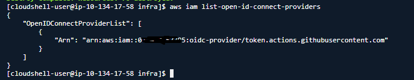

# AWS oidc connect providers設定の確認

## 1.AWSマネージメントコンソールからcloudshellを開く

## 2.下記コマンドを実行

``` shell
aws iam list-open-id-connect-providers
```

## 3.実行結果の確認

githubのoidc connect provider設定有無を確認する。



## 4.terraformのパラメータを変更

未設定の場合 : oidc_flag => true  
設定済の場合 : oidc_flag => false  
