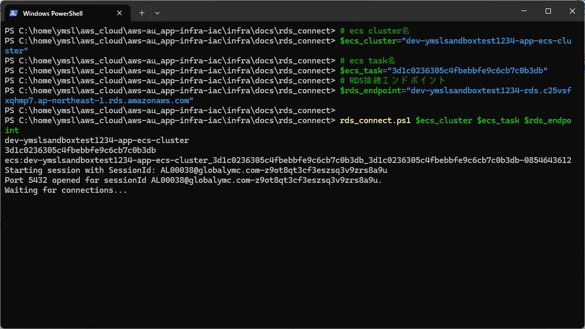

# RDS接続用Powershell

## 実行方法

``` powershell
# ecs cluster名
$ecs_cluster="dev-ymslsandboxtest1234-app-ecs-cluster"
# ecs task名
$ecs_task="3d1c0236305c4fbebbfe9c6cb7c0b3db"
# RDS接続エンドポイント
$rds_endpoint="dev-ymslsandboxtest1234-rds.c25vsfxqhmp7.ap-northeast-1.rds.amazonaws.com"

rds_connect.ps1 $ecs_cluster $ecs_task $rds_endpoint
```

