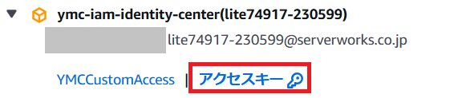

# 一時クレデンシャルの取得

AWSに接続するための一時クレデンシャルの取得

## 1.AWS アクセスポータルにアクセス
下記リンクから、開いてください。  
https://d-95676892f0.awsapps.com/start#/

## 2.接続するアカウントを選び、アクセスキーを選択

## 3.接続する環境に合わせて、タブを切り替える
- ローカルPCで起動したコンテナから接続する（DevContainerで接続）　→　『macOS and Linux』  
- ローカルPCのCloudShellからAWS CLIを使って接続する　→　『Powershell』

## 4.『オプション 1: AWS の環境変数を設定する』欄の値をコピー
コピーした値 ＝ 『一時クレデンシャル』
