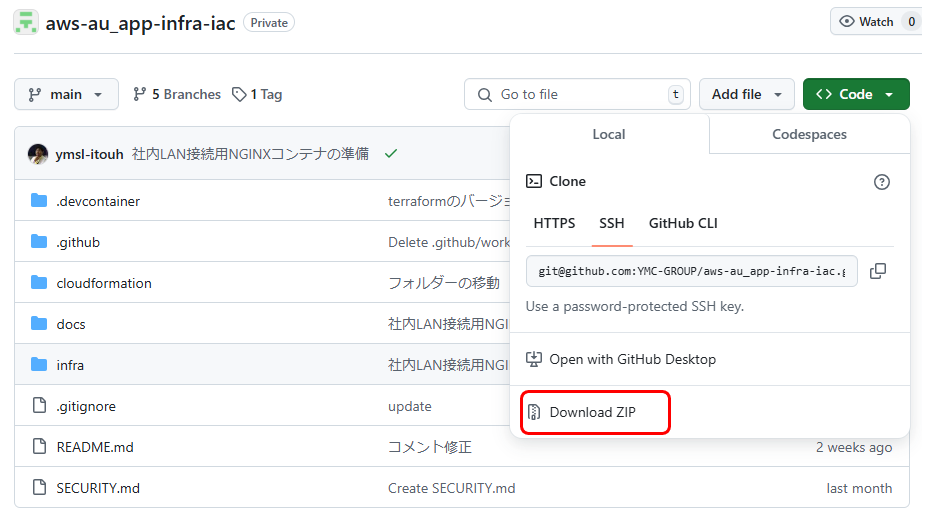
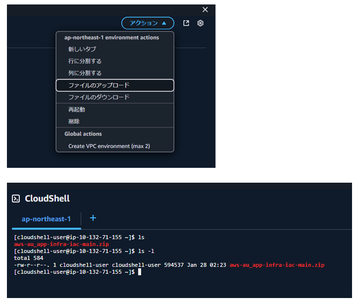
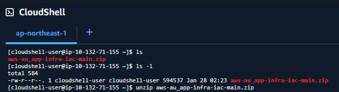
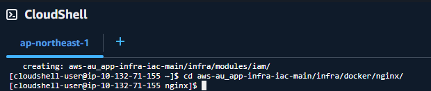
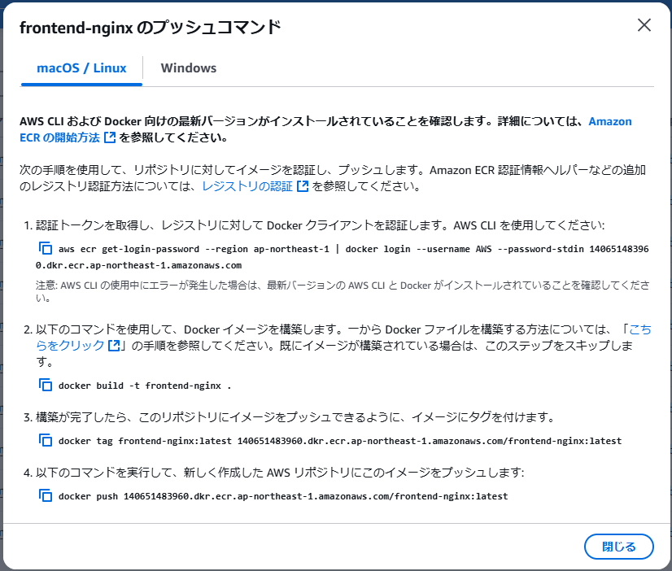

# 社内LAN接続用 NGINXコンテナ作成方法

社内LAN接続で使用するNGINXコンテナの作成方法を解説します。

## 作成手順

1. AWSマネージメントコンソールに接続

2. Cloudshellに接続

3. githubからIaCテンプレートをダウンロード

4. ダウンロードしたファイルをCloudshellにアップロード

5. アップロードしたファイルを解凍

6. ECRレジストリー（frontend-nginx）のプッシュコマンドを表示

7. 解凍フォルダー以下の/infra/docker/nginxフォルダーに移動

8. 下記コマンドを実行

  ※AWSアカウント毎に設定内容が違うため、各環境でプッシュコマンドを表示してください。

